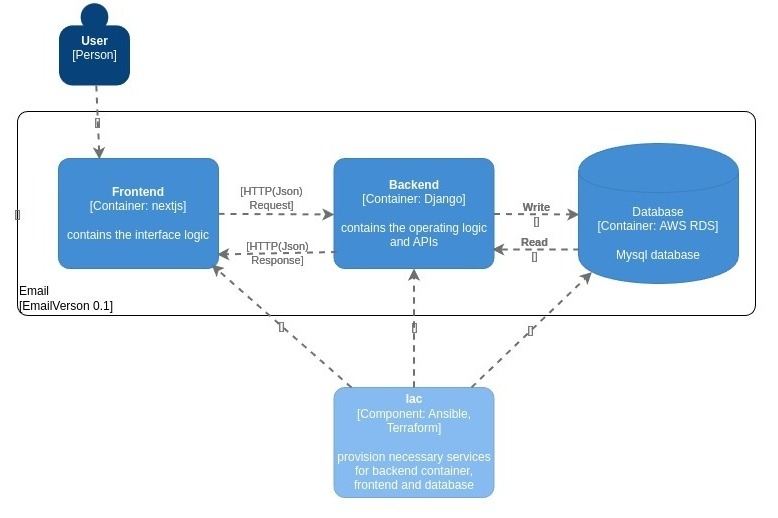
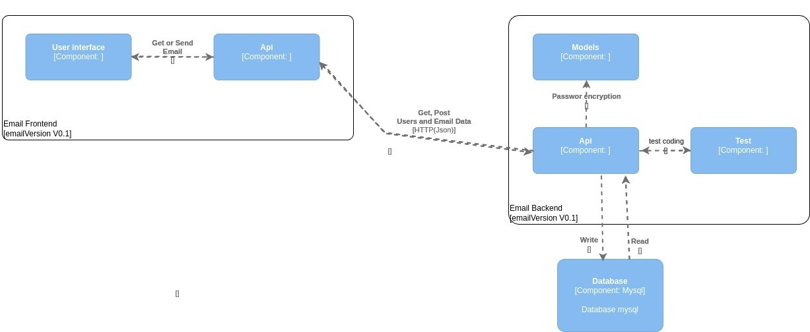

# UPDATES EMAIL HOME GROUP 4

This document provides an overview of the updates to the Home Group 4 project made by Home Group 3. See [Frontend](https://github.com/G3-VER-TECH-FELLOWS/email-G4/blob/main/front-email-g4-main/README.md), [Backend](https://github.com/G3-VER-TECH-FELLOWS/email-G4/blob/main/back-email-g4-main/README.md) and [IAC](https://github.com/G3-VER-TECH-FELLOWS/email-G4/blob/main/iac-email-g4-main/README.md) for more detailed updates and implementations.

## Owners

### Frontend Owners

- Jacobo was chosen as the Front-End owner due to his expertise in architecture, coding best practices, and dockerization.
- Miguel was chosen as the CI/CD Front-End owner due to his eagerness to learn this area, which was new to him.

### Backend Owners
- Daniel was chosen as the Back-End owner due to his critical knowledge of Django, which was essential for understanding the other team's code.
- Miguel was chosen as the CI/CD Back-End owner due to his eagerness to learn this area, which was new to him.
### IAC Owners

- Daniel and Juan were selected as the IAC owners because of their eagerness to learn in this new area.

## Frontend Changes Overview

- Removed `.dockerignore` file, which included various Python, Git, and environment-specific files to ignore during Docker builds.
- Added a new ESLint configuration file `.eslintrc.cjs` focusing on TypeScript and React rules.
- Introduced Continuous Deployment (CD) and Continuous Integration (CI) pipelines with GitHub Actions, specified in `.github/workflows/cd.yml` and `.github/workflows/ci.yml`.
- Updated the Docker configuration, introducing a multi-stage build in `Dockerfile` for optimizing the build process.
- Added a `docker-compose.yml` file for defining and running multi-container Docker applications, setting up the project with specific ports and environment variables.
- Configured Nginx for serving the application through a new `default.conf` file.
- Updated `index.html` to serve as the entry point for the web application, including references to the main JavaScript file and the project's title.
- Significant updates to `package.json`, including changes to the project name, version, scripts, dependencies, and development dependencies.
- Introduced `postcss.config.js` for PostCSS configuration, enabling plugins like Tailwind CSS and Autoprefixer.
- Refactored code across various components (`ComposeView.tsx`, `InboxView.tsx`, `Message.tsx`, etc.) for improvements and removal of unused imports.
- Adjustments in context files (`SelectedEmailContext.tsx`, `UserContext.tsx`, etc.) and icon components to clean up imports and code structure.
- API configuration changes in `src/api.ts` to point to new backend endpoints.
- File structure changes, including the renaming of `src/index.tsx` to `src/main.tsx` and the addition of `src/vite-env.d.ts` for Vite-specific types.
- Created a startup script `start.sh` for setting up environment variables and starting Nginx in Docker containers.
- Updated Tailwind CSS configuration in `tailwind.config.js` to simplify the setup.
- Overhauled TypeScript configuration in `tsconfig.json` and added `tsconfig.node.json` for specific settings related to Node.js environments.
- Introduced a Vite configuration file `vite.config.ts` for customizing the build process and integrating React with SWC.

## Backend Changes Overview

- Code is modified `MyUserManager` class to encrypt the password.
- The views are separated into a module with independent files as controllers.
- The code that calls the actions in the database in the login and send_email.
- Controllers are organized into service modules.
- The `service_send_email` code is simplified by validating the code with try and except
- APIs are documented using swagger, modifying the project setting.
- Changing the connection from Postgres to MySQL to an RDS instance in AWS.
- `Docker compose` is updated and the creation of the db is skipped
- .env folder is created to hold sensitive keys
- `python `decouple` is installed to manage the environmental variables
- `.dockerignore` is updated with .env file
- `Setting` update to add the new DNS and connections to the database located in AWS

## IAC Implementation Overview

Infrastructure as Code (IAC) implementation with Terraform and Ansible offers numerous benefits for businesses, including streamlined deployment, enhanced performance, and cost savings. By automating infrastructure provisioning and management, organizations can achieve greater efficiency, scalability, and agility in their operations. Regular monitoring and optimization are essential for maximizing the effectiveness of the implemented solution and ensuring ongoing success.

## C4 Diagram
### Container diagram

### Component diagram

### New architecture

This AWS architecture utilizes EC2 for hosting both frontend and backend services, with an RDS MySQL database. CI/CD pipelines are implemented using GitHub Actions for automated building, and deployment. Terraform is employed for Infrastructure as Code (IAC) to provision and configure resources like EC2 instances and RDS. Ansible is used to further configure EC2 instances post-provisioning. This setup ensures efficient management and automation of the infrastructure, facilitating continuous integration and deployment processes.

### Why this architecture?

- Decoupling Frontend and Backend: By separating the frontend and backend concerns, you create a more modular architecture. This separation allows for easier maintenance and scalability because changes or updates to one part of the system are less likely to impact the other.
- AWS: In the previous architecture, the project utilized two AWS EC2 instances to accommodate the size of the Docker images. Consequently, the previous team encountered difficulties deploying their Frontend and Backend services. Therefore, we opted to optimize the EC2 architecture by refining the Docker images of both the Backend and Frontend services. This optimization enabled us to streamline operations and utilize only a single AWS EC2 instance.
- Efficient CI/CD Pipeline: Improvements in CI/CD processes and reduced Docker image sizes result in a more agile deployment pipeline. Faster deployments and smaller image sizes lead to faster iteration cycles and less downtime, ultimately improving overall system maintainability.
- Improved Frontend Performance: Utilizing Vite for the front end improves performance due to its fast build times and hot module replacement. This allows for quicker development iterations and a smoother user experience. Additionally, optimizing React hooks can further enhance performance by reducing unnecessary re-renders and improving component efficiency.
- Structured Backend Organization: The backend's transition from a monolithic structure to a more organized setup with models, routes, controllers and services enhances maintainability. Separating concerns into distinct components makes the codebase more readable, easier to debug, and simpler to extend or modify as requirements change.

## Summary

- Frontend: The project has undergone significant updates, including the removal of certain files, the introduction of new configurations for ESLint, Docker, Nginx, GitHub Actions CI/CD pipelines, and updates to package dependencies and scripts. Code refactoring was performed across various components and contexts to improve maintainability and performance. Additionally, the build and deployment processes have been optimized with the introduction of Vite and updated Docker configurations.
- Backend: Relevant changes were made to some modules, finding a way to solve some important technical issues, as well as efforts to standardize some files and modules so that they could be read more easily.
- IAC: As businesses grow and evolve, the demand for scalable, reliable, and efficient infrastructure becomes increasingly crucial. Manual infrastructure provisioning and configuration are prone to errors, inconsistencies, and inefficiencies. Therefore, automating these processes using IAC tools like Terraform and Ansible can significantly improve operational efficiency, reduce downtime, and enhance agility.

